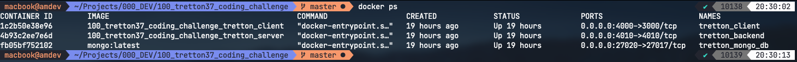
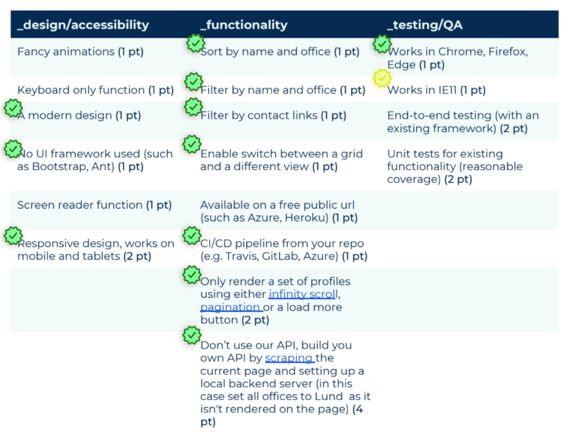
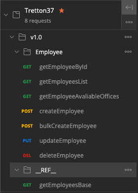
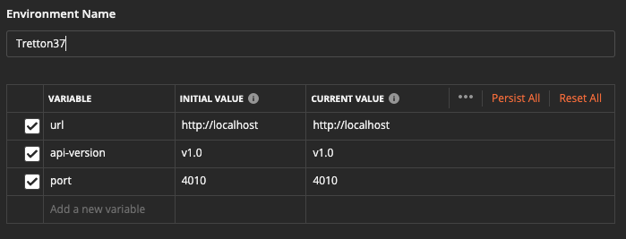
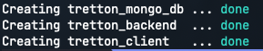

## Tretton37 Coding Challenge

This Repo is a simple MERN Stack Project for Tretton37 Coding challenge! This project has been containerized with Docker and there is a docker-compose.yml file in the root directory to boot up the both server and client side services together!

There are 3 services involved in this project:

1. Database Service (tretton_mongo_db)
2. Backend Service (tretton_backend)
3. Client Service (tretton_client)

Here is the picture of docker containers which are in active state:

## The Motivation

First of all before I began this project, I decided to plan for it and I spend like 2 hours to figure out the whole structure, and finally I created this mindmap of my thoughts on project which is avaliable at here: [My Mind Map on This Project](https://coggle.it/diagram/YCFkIwdZHt8ZlV_f/t/tretton-37-front-end)

## Selected Stories

After a while thinking on this project I decided to go with this user stories:

As you can see since I developed the backend side of the project, the most functionality has been implemented by default.

So starting from Design section, I decided to not use some ready UI freameworks like Material UI or bootstrap or something else and I used the `BEM convention` alongside with Sass. I used a simple design, can say functional oriented design ( Hope you like it :), and finally last but not least, I made my project responsive.

In functionality section, I implemented the backend of the project and did not used the provided API in assessment, based on that since I had my own api, and since I was able to manage provided data to the front end by my own, I decided to implement the filtering and sorting stuff in my `getEmployeeList` api. It support **sorting by name and office**, **filtering by name, office and contact links**, **pagination**.

In testing section, I tested my project in backend and front end side and It works in Chrome and firefox , but since I'm using mac, I cound not test the project on windows related browsers like Edge and IE11, but I'm 90% sure that it will work find on both because of postcss support in `create-react-app`(10% because of any kind of wierd and unknown behaviour of them :).

## Technical Description of Project

In this project I chosed to use MERN stack, for Database I used mongoDb, for backend I used NodeJs with and the casual `mongoose` ORM, for client side I used React and since project is not big enugh I decided to use `Context API` of react instead of Redux or recoil and other state managment solutions. Also I used `Sass` for styling with `BEM` convention (which I mostly do in projects).

### back-end

I created a Restfull API for backend and definitely it could be scaled as a graphQl service ( may be next step on this project ;), and I used Joi to validate data that comes with request in order to get clean input from client side to prevent insert the bad data to database.

Also I did not created the DTOs for employee domain, just to handle the backend as fast as possible.

It is worth noting that there is a directory at `server/postman` which includes two files, **the post man collection**, and **the postman environment**. you can import them and use the Restfull Api provided by backend container!

Here is the picture of postman collection:

and here is the environment variables:

Both of these are available at `/server/postman` directory.

### front-end

In the client side I followed the container way of structuring the project. I put commonly used components in to the `client/src/components` folder, and entire project has been developed in modular way, in which every component has a clear folder structure for itself, which most of the time includes these files and makes it easily managable and maintainable:

1. Component File itself
2. A `Manager` file to manage the logic of the component
3. A `context` file ( optional for complex logics only )
4. A `Sass` file for styling
5. An `index` barrel file

I used `react-router-dom` to create 2 simple route:

1. `/` which renders the list of employees
2. `/:employeeId` which renders the detail page for an employee
3. And a fallback page for not found routes

Some of features that i did in my client side project that worth mentioning:

- used `waypoint` to handle the infinite scrolling
- used `formik` for managing the search form
- used `Yup` for validationg the form inputs
- used a custome hook (`useFetch`) for api call which is avaliable at `client/src/hooks`
- created a simple mini UI Kit avaliable at `components` directory
- and many more...

So lets dive in to the booting the project up!

---

## How to run project

Actually for setting up the project you only need to run one single command: `docker-compose up -d`, but for more description read below.

### Pre requisits:

- you need to install [Docker](https://docs.docker.com/get-docker/) in your Computer!
- you need to install the [Docker-compose](https://docs.docker.com/compose/install/)
- you may want to have postman app installed on you computer for intracting with API that comes on backend project, [install it from here](https://www.postman.com/downloads/)

Also note that I have included the `.env` files in this project, so there is no need to do any thing ( im aware that i should not do this, and how bad practice it is, but i wanted to make the steps easy as possible )

## Steps:

1. clone the repository and `cd` to the directory.
2. run `docker-compose up -d`, this step would create 3 containers from scratch at the first time, and i can say that when creating the `tretton_client` container, it would take some time to install pkgs for react project, and since it is in silence mode, you would see nothing when it comes to run `npm run install` command, so don't be worry about being stuck or something else, just wait for almost 2 mins, it will install and create the container! at the end of this step you would see something like this:  
   
3. congrats, you did it! now you can open the `http://localhost:4000/` and see that client side is ready! also you can access the backend api's at `http://localhost:4010` and mongoDB at port `27020` with user name of `root` and pass of `examplePass`

### One Important Note

Immediately after database connection happens in backend side, **I seed `/server/src/seeder/__mock_data__/employees.json` data to the database**. and there after, we have predefined employees in our system.

## screen shots

Here you can see some screenshots of the project: `/docs/screenshots/`

---

## what I might do in the next steps:

There is a list of things to do as a next step:

1. It will be very interesting if i could re-arch the backend service to `graphQL` based API (I promise you ;)
2. I might use **typescript** for static type checking
3. use **snapshot**, **unit** and **integration** test in client side also for backend side might use unit and **integration** tests ( please note that this is a must! and i do it in most of my projects, but for lack of time i could not implement it)
4. instead of writing `seeder` functions to seed some data to database, I could handle it in my `docker-compose` file with help of an image like [`mongo-seed`](https://github.com/stefanwalther/docker-mongo-seed) image from docker hub
5. I can use something like [`Intersection Observer API`](https://developer.mozilla.org/en-US/docs/Web/API/Intersection_Observer_API) in order to reduce http request for employee avatars in list, and implemented in such a way that gets the employees image when employees card appears in the screen or in some reasonable threshold of entering to the screen (that would be really nice thing to handle).
6. definitly this is not a bug free application, of course there would be some bugs, and I should resolve.

Hope you Best!  
Ahmad (@a_m_dev)
